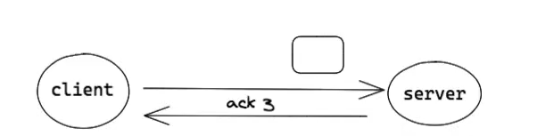

# netty的深入学习

本次学习将从以下部分入手

* 网络编程基础
  * Tcp协议
  * Socket协议
  * BIO & NIO
  * Reactor模式
  
* Netty

    * Netty核心组件介绍
    * Netty部分源码分析
    * 处理粘包

## TCP协议

​	TCP是一种面向连接的、可靠的、基于字节流的传输层通信协议。

*  为什么要有“连接”?“连接”究竟是什么?

* Byte stream oriented vs Message oriented

### 为什么要有连接？连接究竟是什么？

* 为什么要有连接？

  因为网络连接是不可靠的，难免出现丢包或者包发送的时间顺序错误。网络传输不像是打电话是点到点的，必须考虑这些问题。

* 连接是什么？

  连接是一种传输协议，或者是一种校验机制。校验想要发送的包是否如期待值一样发送到指定的位置。

  eg：例如我们打电话，通话不畅，我们就会问对方听到了吗，直到听到了我们才继续讲要说的事。tcp也是这样，中间这个校验过程用的是什么方法，就是什么协议。

下面来讲一讲tcp协议：

