# netty的深入学习

本次学习将从以下部分入手

* 网络编程基础
  * Tcp协议
  * Socket协议
  * BIO & NIO
  * Reactor模式
  
* Netty

    * Netty核心组件介绍
    * Netty部分源码分析
    * 处理粘包


## TCP协议

​	TCP是一种面向**连接**的、**可靠**的、基于**字节流**的传输层通信协议。

* tcp与http不同，tcp是基于字节流的，将数据转成一个个封包发送，而http是一次性将所有数据发送，当成一个请求。

*  为什么要有“连接”?“连接”究竟是什么?

* Byte stream oriented vs Message oriented


### 为什么要有连接？连接究竟是什么？

* 为什么要有连接？

  因为网络连接是不可靠的，难免出现丢包或者包发送的时间顺序错误。网络传输不像是打电话是点到点的，必须考虑这些问题。

* 连接是什么？

  连接是一种传输协议，或者是一种校验机制。需要进行数据共享的双方通过某种协议进行数据的交换，这样的行为称之为连接。

  eg：例如我们打电话，通话不畅，我们就会问对方听到了吗，直到听到了我们才继续讲要说的事。tcp也是这样，中间这个校验过程用的是什么方法，就是什么协议。

下面来讲一讲tcp协议：

* 早期tcp协议：当数据包发送到 服务器后，服务器需要发送ack请求返回客户端进行确认，确认后再进行下一个包的发送。
  * 存在问题：效率低下，一次请求一个包，实在太慢了。
* 批处理的tcp协议：一次发送多个数据，当全部数据接受到后返回末尾数据包的数值。例如，发送数据1、2、3，当服务器全部接受到后返回ack=3。当数据包出现问题后则回退N步，客户端会重新发送1、2、3数据包回来，直到收到了ack=3的命令。
  * 回退N步（目前使用）：使用的是滑动窗口协议，每次发送指定数量的数据包，服务器端收到后，返回ack=对应数值，然后再进行下一次发送。如果发送失败，则客户端重新再次发送所有的数据包。
  * 选择性重发：哪个数据包发送失败，就重新发送哪个数据包。

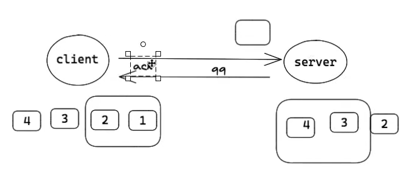

​	受当时的技术水平影响，当时普遍认为选择性重发的实现比回退N步来说更难，所以选择了回退N步充当tcp的交换协议。

​	滑动窗口协议：发送使用的算法是滑动窗口，当1、2、3发送后，我们收到了ack=3，则滑动窗口到4，继续下个窗口。窗口大小则是每次我们发送的数据包大小。

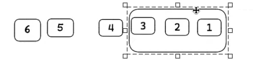

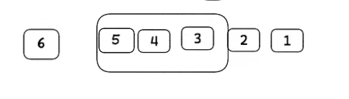

实际使用中，为了防止被窃取信息，起始序号都是随机的。

### tcp的三次握手

* 为什么要三次？而不是两次或四次？

  三次是保证双方互相明确对方能收能发的最低值。理论上讲不论握手多少次都不能确认一条信道是“可靠”的，但通过3次握手可以至少确认它是“可用”的，再往上加握手次数不过是提高“它是可用的”这个结论的可信程度。

  简单来说：三次握手应该叫双向握手，双向确认的过程。

  eg：举个例子，我追小露，小露特别乖又体贴，我很担心别人抢走她，所以我想让她当我女朋友。（发起请求）

  第一次握手：我喜欢你呀balabalabal.....做我女朋友好不啦。

  第二次握手：可以呀，balabalabal......但是balabalabala，这样的话，你还喜欢我吗？（接受请求，但不确定对方是否会接收到确认请求，所以必须要对方再次确认才可以知道）

  第三次握手：当然喜欢了，balabalabal......（此时就达成了双向握手+双向确认的情况）

* 三次握手过程

  * SYN(synchronous 建立连接) 
  * ACK(acknowledgement 确认) 
  * Sequence number(顺序号码) 

  1、浏览器发送数据包给服务器，数据包里面包含 SYN=1(表示建立连接)，Seq（身份码） 

  2、服务器发送数据包给浏览器，数据包包含 ACK=1（表示确认建立连接）， ack=seq+1（表 

  示确认身份）和 SYN=1(表示建立连接)，Seq（身份码） 

  3、浏览器发送数据包给服务器，数据包包含 ACK=1,ack=seq+1，完成建立连接。

### tcp四次挥手


### Socket API

​	这边拿服务端举例，这是伯克利大学的一个教授所做，所以也有人把它称之为伯克利套字节。

* Socket()：初始化socket
* Bind()：绑定一个端口
* Listen()：监听端口。
* Accept()：完成连接的建立，Accept()这个过程就是显性的从接收队列里拿封包的过程。这个过程中服务器端需要维护两个队列。
  * sync queue：将接收到的连接放到队列里面去。
  * accept queue：将完成的连接放到这个队列里去。

* Read()/Write():可以给对方发消息或者接收消息。
* Close():关闭连接。

从listen到Accept这个过程就发生了三次握手。


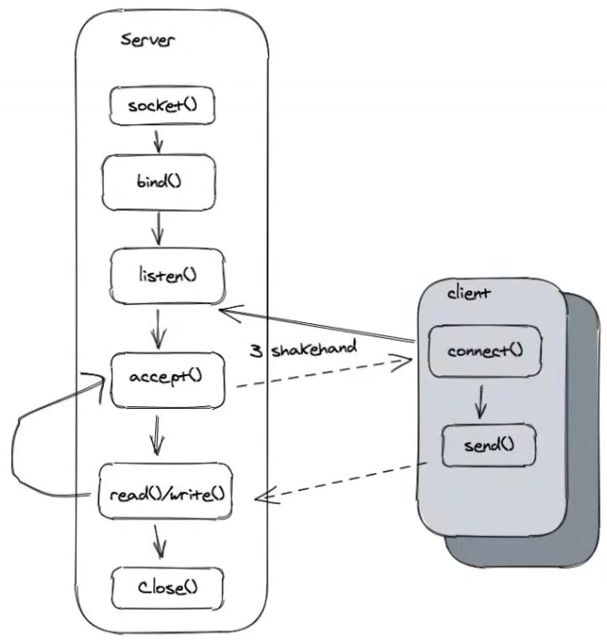

## BIO&NIO

java存在的Socket，以下是它API的类：

* BIO
  * ServerSocket
  * Socket
* NIO
  * ServerSocketChannel
  * SocketChannel

### BIO 

#### 案例 

模拟一段BIO服务器端进行Socket编程：

```java
public class BIOServer {
    public static void start(int port) throws IOException {
        //1、建立socket连接
        ServerSocket serverSocket = new ServerSocket();
        //2、绑定和监听
        serverSocket.bind(new InetSocketAddress(port),2);
        //支持连接的端口号和连接数
        //3、起线程跑连接，或者用线程池。
        while (true){
            final Socket clientSocket = serverSocket.accept();
            System.out.println("accept");//标识接收到了请求
            new Thread(()->{
                try {
                    BufferedReader in = new BufferedReader(new InputStreamReader(clientSocket.getInputStream()));
                    PrintWriter out = new PrintWriter(clientSocket.getOutputStream(),true);
                    String line = in.readLine();//阻塞
                    while(line !=null){
                        out.println(line);
                        out.flush();
                        line=in.readLine();
                    }
                    clientSocket.close();
                } catch (IOException e) {
                    e.printStackTrace();
                }

            });
        }
    }

    public static void main(String[] args) throws IOException {
        start(2020);
    }
}
```

启动cmd然后和我们的程序建立连接：

```shell
telnet localhost 2020
```

然后执行cmd命令发现成功：

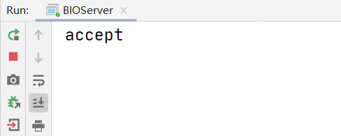

#### 阻塞分析

红色部分代表了阻塞，下面解释一下阻塞的原因：

* accept:阻塞是因为网络传输的问题等
* read&parse:需要解决字节边界问题，需要截取每个请求需要的字节。当收不到请求字节了，就要切换线程。当发送的请求断断续续的，每次接收一点就要切换一次后，阻塞就会非常严重。
* write:接收方有缓存大小，类似于窗口大小，当接收到足够的数据包才会写出去。例如，需要数据包为1-5，但只接受到了2-5，那我们会一直堵塞，直到得到数据包1。

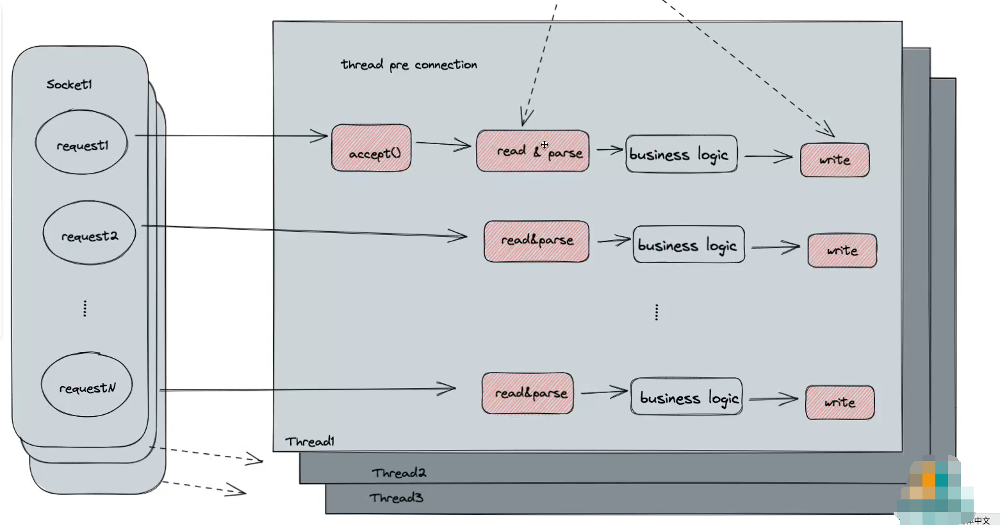

tcp也有自己的一套流量控制和拥塞控制算法，所以tcp天生拥有背压能力，能够很天然的适应流量弹性的变化。	

#### 缺点

​	上下文切换：在read&parse过程中，我们需要去切割字节，获取到对应的请求，但如果此时网络不畅，那么我们接收到的封包就会断断续续的，过了一段时间后就会切换下个线程。

​	eg：如果A线程需要的数据是0-100，我的线程是A,B,C。刚开始A线程接收到50个数据，接下去因为网络原因无法接受到了，所以切换到了B或者C线程。这时候如果又来了10个A所需的数据又要切换到A接收，这样非常浪费时间。

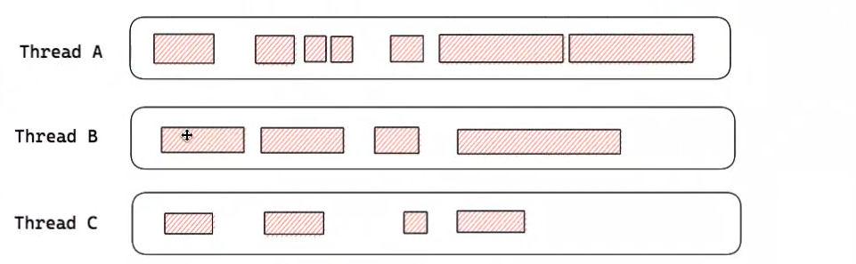

总结：可以发现，当我们的连接数多了，我们传统的blocking的服务器模型，效率就很低了。为了解决BIO的上下文切换存在的问题，我们引出了NIO

### NIO

​	核心目标：减少线程数，减少上下文切换问题。

​	解决办法：将accept、read&parse、write放入更为底层的部分，放入到一个线程中，由一个线程去统筹其他的线程来执行这些操作。比如说，当网络断断续续后，这个线程可以通知正在read过程中被阻塞的线程别阻塞了，切换到其他的Socket线程进行读。

下面是NIO的模型，采用操作系统事件的机制，我们将统筹所有连接的线程称之为Selector：

#### 模型解释

​	负责多个Socket连接，当Socket的状态发生变化了，都会通知Selector。Selector会对所有的连接进行轮询（定时任务），做对应事件的事情，所以不会涉及到任何的浪费。

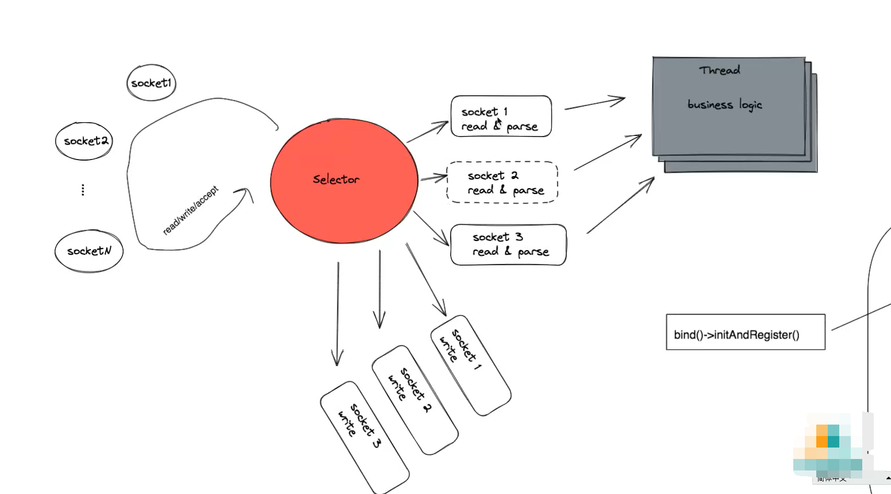

#### Selector API

* channel.register(selector) ：注册监听
* while(true)+ select()：轮询事件
* selectedKeys()：获得selectionKey对象，表示channel的注册信息
* SelectionKey.attach()对selectionkey：关联任何对象
* isReadable()/ isAcceptable()/ isWritable()：判断事件类型
* 事件类型：OP_ACCEPT/OP_READ/OP_WRITE/OP_CONNECT

 #### 整体步骤

* 把想要被Selector监听的ServerSocket注册到channel上
* 无限轮询，然后去查看Socket的状态
* 一旦轮询到需要的对象，使用selectedKeys去获取对象
* 根据事件类型（ACCEPT、READ、WRITE、CONNECT），根据这四种状态去进行相应的操作。

#### 案例

​	举例说明下步骤，一共七步走，

* 第一步：创建一个信道
* 第二步：设置是否阻塞并设置端口号，这里要用NIO肯定是非阻塞的
* 第三步：同BIN过程，绑定套接字地址,这里可以绑定多个，只要在后面加上.bin即可
* 第四步：创建selector并绑定事件
* 第五步：进行轮询，查看是否有注册过channel的状态得到了满足
* 第六步：从selector中得到集合，但也有可能Socket状态都没改变，集合为空
* 第七步：进入事件处理三步走
  * 从信道中获取连接
  * 同BIO过程，对其进行accept
  * 设置连接非阻塞，并且转换连接的状态

```java
public class NIOServer {
    public static void start(int port) throws IOException {
        //1、创建一个信道
        ServerSocketChannel serverSocketChannel = ServerSocketChannel.open();
        //2、设置是否阻塞并设置端口号，这里要用NIO肯定是非阻塞的
        serverSocketChannel.configureBlocking(false);
        InetSocketAddress address = new InetSocketAddress(port);
        //3、同BIN过程，绑定套接字地址,这里可以绑定多个，只要在后面加上.bin即可
        serverSocketChannel.bind(address);
        //4、创建selector并绑定事件
        Selector selector = Selector.open();
        serverSocketChannel.register(selector, SelectionKey.OP_ACCEPT);
        while(true){ //这里如果只请求一次不会出错
            //5、进行轮询，查看是否有注册过channel的状态得到了满足
            //但是这块底层会有一些bug，因为非阻塞，所以while会空转
            selector.select();
            //6、从selector中得到集合，但也有可能Socket状态都没改变，集合为空
            Set<SelectionKey> readyKeys = selector.selectedKeys();
            Iterator<SelectionKey> it = readyKeys.iterator();
            //7、进入事件处理三步走
            while (it.hasNext()){ //进入事件处理三步走
                SelectionKey key = it.next();
                if (key.isAcceptable()){
                    //(1)、从信道中获取连接
                    ServerSocketChannel server = (ServerSocketChannel) key.channel();
                    //(2)、同BIO过程，对其进行accept
                    SocketChannel socket = server.accept();
                    System.out.println("Accept !");
                    //(3)、设置连接非阻塞，并且转换连接的状态
                    socket.configureBlocking(false);
                    socket.register(selector,SelectionKey.OP_READ);//将其从accept转换成read
                    System.out.println("经历了一次状态转换过程");
                }
                if (key.isReadable()) {
                    //(1)、从信道中获取连接
                    SocketChannel socket = (SocketChannel) key.channel();
                    //(2)创建字节流，接受传入的流
                    final ByteBuffer buffer =ByteBuffer.allocate(64);
                    final  int bytesRead =socket.read(buffer);//读取流
                    if (bytesRead>0){
                        buffer.flip();//翻转缓冲区，理解成刷新缓存
                        int ret =socket.write(buffer);
                        if (ret<=0){
                            socket.register(selector,SelectionKey.OP_WRITE);
                        }
                        buffer.clear();
                    } else  if (bytesRead<0){
                        key.cancel();
                        socket.close();
                        System.out.println("Client close");
                    }
                }
                it.remove();
            }
        }
    }
    public static void main(String[] args) throws IOException {
        start(2020);
    }
}
```

测试一下，运行程序，打开cmd连接端口号：

```shell
telnet localhost 2020
```

查看结果：

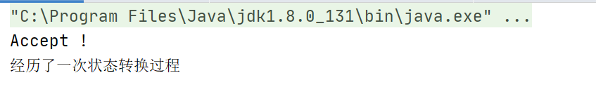

这里会存在一个问题，因为NIO非阻塞，所以当没接收到Socket连接的时候会存在空转问题，空转就是while(true)就会一直执行，直到吧内存占满。

#### 缺点

* 空转问题(会报错):因为NIO是非阻塞的，所以当没有请求后，也不会阻塞。此时while(true)就会一直执行，直到吧内存占满。

* 代码不好复用，如果我需要实现某一功能并没有BIO那么容易，也不好抽取出来成单独模块。

  虽然NIO有缺点，但NIO的非阻塞和单线程处理Socket对效率的提升而言非常大，所以我们还是得用。往后我们就引入了**Reactor模式**，即**响应式编程**。

### Reactor

​	Reactor是响应式编程，**响应式编程（RP）是一种基于异步数据流概念的编程范式**。而**RP**的精髓也在于对数据流（Dataflow， Event）的高效处理。

#### 单Reactor单线程模型

​	消息处理流程：

* Reactor对象通过select监控连接事件，收到事件后通过dispatch进行转发。
* 如果是连接建立的事件，则由acceptor接受连接，并创建handler处理后续事件。
* 如果不是建立连接事件，则Reactor会分发调用Handler来响应。
* handler会完成read->业务处理->send(就是write)的完整业务流程。

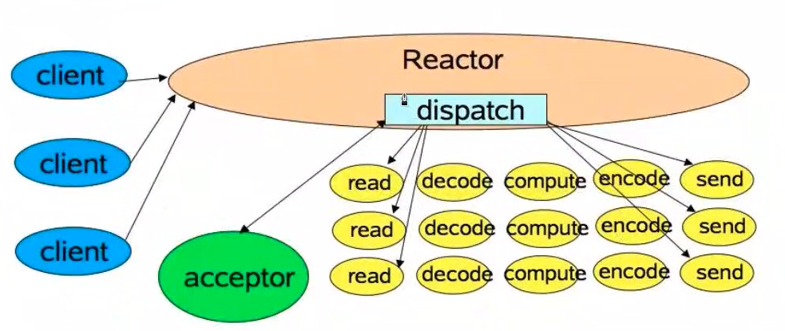

##### 案例

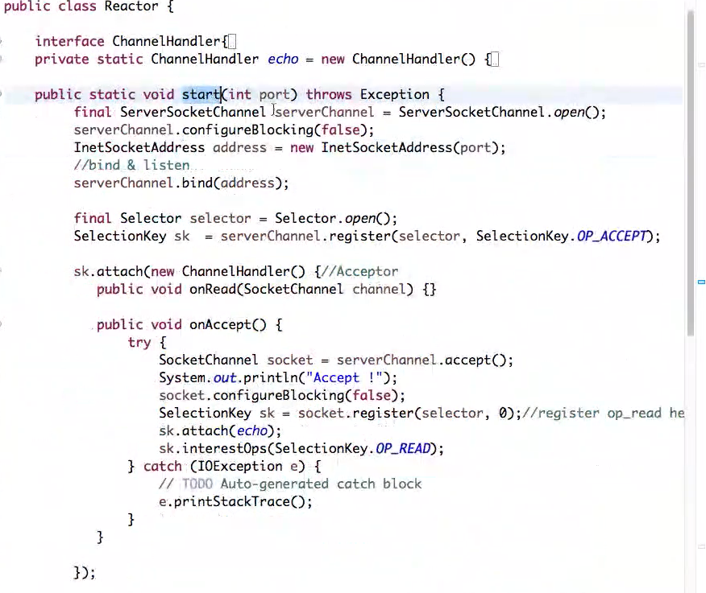

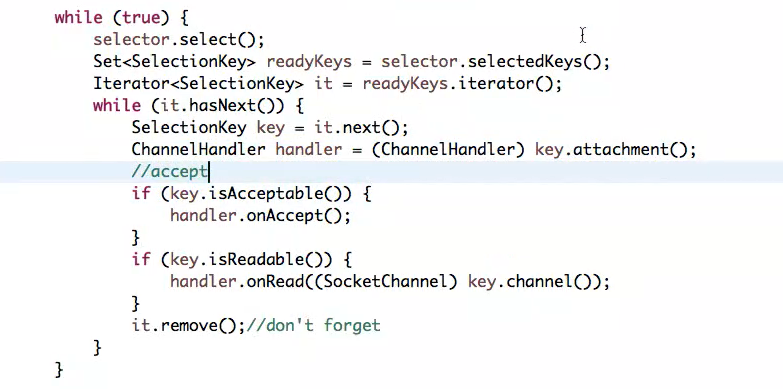

##### 缺点

* 即便Reactor线程的CPU负荷达到100%，也无法满足海量消息的编码、解码、读取和发送。
* 当Reactor线程负载过重之后，处理速度将变慢，这会导致大量客户端连接超时，超时之后往往会进行重发，这更加重Reactor线程的负载，最终会导致大量消息积压和处理超时，成为系统的性能瓶颈。
* 一旦Reactor线程意外中断或者进入部消息，造成节点故障。

总结：当处理的行为单次消耗时间过多，或者行为量过多，又或者单个线程出现了故障就会单Reactor单线程模型出现问题的情况。

####  单Reactor多线程模型

​	该模型在事件处理器（Handler）部分采用了多线程（线程池）

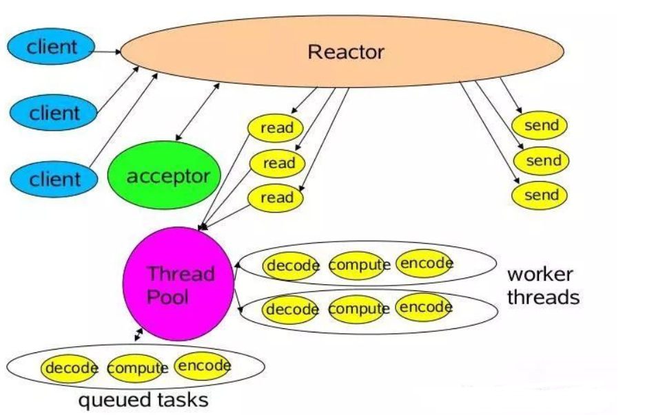

​	消息处理流程：

* Reactor对象通过Select监控客户端请求事件，收到事件后通过dispatch进行分发。
* 如果是建立连接请求事件，则由acceptor通过accept处理连接请求，然后创建一个Handler对象处理连接完成后续的各种事件。
* 如果不是建立连接事件，则Reactor会分发调用连接对应的Handler来响应。
* Handler只负责响应事件，不做具体业务处理，通过Read读取数据后，会分发给后面的Worker线程池进行业务处理。
* Worker线程池会分配独立的线程完成真正的业务处理，如何将响应结果发给Handler进行处理。
* Handler收到响应结果后通过send将响应结果返回给Client。

  相对于第一种模型来说，在处理业务逻辑，也就是获取到IO的读写事件之后，交由线程池来处理，handler收到响应后通过send将响应结果返回给客户端。这样可以降低Reactor的性能开销，从而更专注的做事件分发工作了，提升整个应用的吞吐。

##### 缺点

* 多线程数据共享和访问比较复杂。如果子线程完成业务处理后，把结果传递给主线程Reactor进行发送，就会涉及共享数据的互斥和保护机制。
* Reactor承担所有事件的监听和响应，只在主线程中运行，可能会存在性能问题。例如并发百万客户端连接，或者服务端需要对客户端握手进行安全认证，但是认证本身非常损耗性能。

总结：线程间的通信会涉及到数据的互斥和保护机制，单Reactor需要承担所有的事件监听和响应，且只在主线程里面做，当请求的连接到达了百万级，可能会出现宕机等事。

#### 主从Reactor多线程模型

​	比起第二种模型，它是将Reactor分成两部分：

* mainReactor负责监听server socket，用来处理网络IO连接建立操作，将建立的socketChannel指定注册给subReactor。
* subReactor主要做和建立起来的socket做数据交互和事件业务处理操作。通常，subReactor个数上可与CPU个数等同。

Nginx、Swoole、Memcached和Netty都是采用这种实现。

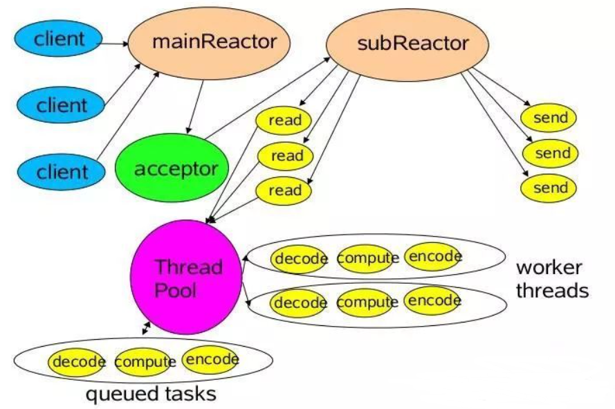


​	消息处理流程：

* 从主线程池中随机选择一个Reactor线程作为acceptor线程，用于绑定监听端口，接收客户端连接
* acceptor线程接收客户端连接请求之后创建新的SocketChannel，将其注册到主线程池的其它Reactor线程上，由其负责接入认证、IP黑白名单过滤、握手等操作
* 以上步骤完成之后，业务层的链路正式建立，将SocketChannel从主线程池的Reactor线程的多路复用器上摘除，重新注册到Sub线程池的线程上，并创建一个Handler用于处理各种连接事件
* 当有新的事件发生时，SubReactor会调用连接对应的Handler进行响应
* Handler通过Read读取数据后，会分发给后面的Worker线程池进行业务处理
* Worker线程池会分配独立的线程完成真正的业务处理，如何将响应结果发给Handler进行处理
* Handler收到响应结果后通过Send将响应结果返回给Client

##### 缺点

​	这是目前最好的一种模式，硬要说缺点的话只能是：

* 多线程切换在没有那么高并发的情况下，花销特别大。
* 需要的硬件配置比先前两个高了

##### 总结

Reactor模型具有如下的优点：

* 响应快，不必为单个同步时间所阻塞，虽然Reactor本身依然是同步的；
* 编程相对简单，可以最大程度的避免复杂的多线程及同步问题，并且避免了多线程/进程的切换开销；
* 可扩展性，可以方便地通过增加Reactor实例个数来充分利用CPU资源；
* 可复用性，Reactor模型本身与具体事件处理逻辑无关，具有很高的复用性。

