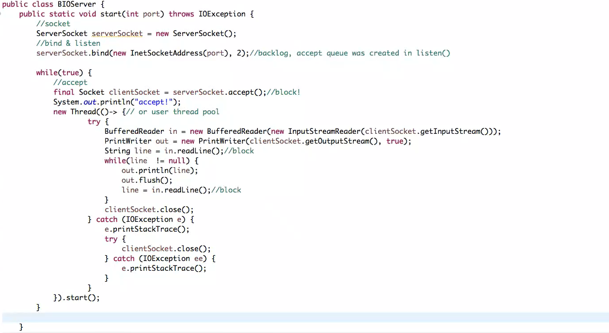
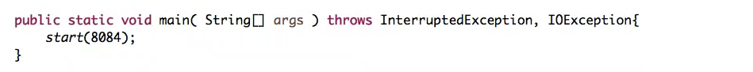
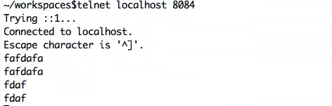

# netty的深入学习

本次学习将从以下部分入手

* 网络编程基础
  * Tcp协议
  * Socket协议
  * BIO & NIO
  * Reactor模式
  
* Netty

    * Netty核心组件介绍
    * Netty部分源码分析
    * 处理粘包

## TCP协议

​	TCP是一种面向**连接**的、**可靠**的、基于**字节流**的传输层通信协议。

* tcp与http不同，tcp是基于字节流的，将数据转成一个个封包发送，而http是一次性将所有数据发送，当成一个请求。

*  为什么要有“连接”?“连接”究竟是什么?

* Byte stream oriented vs Message oriented

### 为什么要有连接？连接究竟是什么？

* 为什么要有连接？

  因为网络连接是不可靠的，难免出现丢包或者包发送的时间顺序错误。网络传输不像是打电话是点到点的，必须考虑这些问题。

* 连接是什么？

  连接是一种传输协议，或者是一种校验机制。需要进行数据共享的双方通过某种协议进行数据的交换，这样的行为称之为连接。

  eg：例如我们打电话，通话不畅，我们就会问对方听到了吗，直到听到了我们才继续讲要说的事。tcp也是这样，中间这个校验过程用的是什么方法，就是什么协议。

下面来讲一讲tcp协议：

* 早期tcp协议：当数据包发送到 服务器后，服务器需要发送ack请求返回客户端进行确认，确认后再进行下一个包的发送。
  * 存在问题：效率低下，一次请求一个包，实在太慢了。
* 批处理的tcp协议：一次发送多个数据，当全部数据接受到后返回末尾数据包的数值。例如，发送数据1、2、3，当服务器全部接受到后返回ack=3。当数据包出现问题后则回退N步，客户端会重新发送1、2、3数据包回来，直到收到了ack=3的命令。
  * 回退N步（目前使用）：使用的是滑动窗口协议，每次发送指定数量的数据包，服务器端收到后，返回ack=对应数值，然后再进行下一次发送。如果发送失败，则客户端重新再次发送所有的数据包。
  * 选择性重发：哪个数据包发送失败，就重新发送哪个数据包。

​	受当时的技术水平影响，当时普遍认为选择性重发的实现比回退N步来说更难，所以选择了回退N步充当tcp的交换协议。

​	滑动窗口协议：发送使用的算法是滑动窗口，当1、2、3发送后，我们收到了ack=3，则滑动窗口到4，继续下个窗口。窗口大小则是每次我们发送的数据包大小。

实际使用中，为了防止被窃取信息，起始序号都是随机的。

### tcp的三次握手

* 为什么要三次？而不是两次或四次？

  三次是保证双方互相明确对方能收能发的最低值。理论上讲不论握手多少次都不能确认一条信道是“可靠”的，但通过3次握手可以至少确认它是“可用”的，再往上加握手次数不过是提高“它是可用的”这个结论的可信程度。

  简单来说：三次握手应该叫双向握手，双向确认的过程。

  eg：举个例子，我追小露，小露特别乖又体贴，我很担心别人抢走她，所以我想让她当我女朋友。（发起请求）

  第一次握手：我喜欢你呀balabalabal.....做我女朋友好不啦。

  第二次握手：可以呀，balabalabal......但是balabalabala，这样的话，你还喜欢我吗？（接受请求，但不确定对方是否会接收到确认请求，所以必须要对方再次确认才可以知道）

  第三次握手：当然喜欢了，balabalabal......（此时就达成了双向握手+双向确认的情况）

* 三次握手过程

  * SYN(synchronous 建立连接) 
  * ACK(acknowledgement 确认) 
  * Sequence number(顺序号码) 

  1、浏览器发送数据包给服务器，数据包里面包含 SYN=1(表示建立连接)，Seq（身份码） 

  2、服务器发送数据包给浏览器，数据包包含 ACK=1（表示确认建立连接）， ack=seq+1（表 

  示确认身份）和 SYN=1(表示建立连接)，Seq（身份码） 

  3、浏览器发送数据包给服务器，数据包包含 ACK=1,ack=seq+1，完成建立连接。

### tcp四次挥手

### Socket API

​	这边拿服务端举例，这是伯克利大学的一个教授所做，所以也有人把它称之为伯克利套字节。

* Socket()：初始化socket
* Bind()：绑定一个端口
* Listen()：监听端口。
* Accept()：完成连接的建立，Accept()这个过程就是显性的从接收队列里拿封包的过程。这个过程中服务器端需要维护两个队列。
  * sync queue：将接收到的连接放到队列里面去。
  * accept queue：将完成的连接放到这个队列里去。

* Read()/Write():可以给对方发消息或者接收消息。
* Close():关闭连接。

从listen到Accept这个过程就发生了三次握手。

## BIO&NIO

java存在的Socket，以下是它API的类：

* BIO
  * ServerSocket
  * Socket
* NIO
  * ServerSocketChannel
  * SocketChannel

编写一段BIO服务器端进行Socket编程：

使用它：

