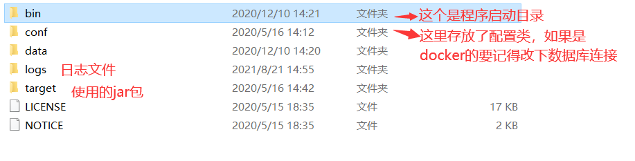
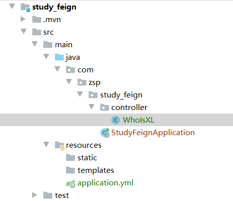
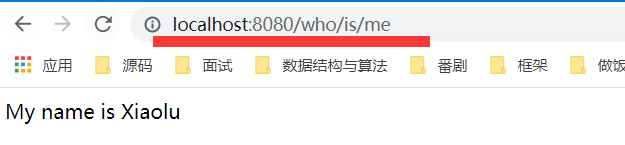
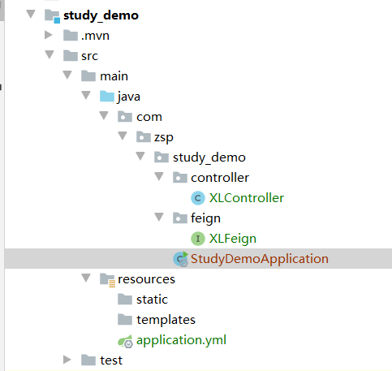
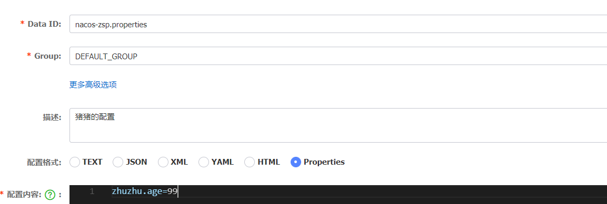

# Nacos

小露可以先看一下这个笔记，看不懂也没事，我双休日教你，别怕~

### 什么是Nacos？

Nacos 是阿里巴巴推出来的一个新开源项目，这是一个更易于构建云原生应用的动态服务发现、配置管理和服务管理平台。

### Nacos能做什么？

* 服务发现和服务健康监测（注册中心）
* 动态配置服务（配置中心）
* 动态 DNS 服务
* 服务及其元数据管理

ps：

* 注册中心：指服务注册到nacos上后，你可以根据注册上的服务使用对应的接口，一般配合openfeign使用，或者dubbo。
* 配置中心：指配置类写到nacos上，此后所有模块的配置都会去nacos里先找，然后在使用自己的配置类。

总结一下：主要功能就是作为注册中心和配置中心。

### Nacos使用

#### Nacos安装

nacos需要预先下载安装：

* Windows版本的已经给小露提前下载准备好了
  * 使用压缩包解压缩后在bin目录下打开startup.cmd即可
  * 登陆http://localhost:8848/nacos，不一定是8848端口，如果端口被占用得看启动后的日志
  * 用户名密码都是nacos
* linux版本的压缩包也给小露提前下载准备好了
  * 先使用命令“tar -zxvf nacos-server-1.1.4.tar.gz ”解压
  * 然后到bin目录下，使用“sh startup.sh -m standalone”启动
  * 或者使用“bash startup.sh -m standalone”启动，用户名密码都一样
* docker版本，这个版本不需要下载，直接拉取就可以
  * 使用命令“docker pull nacos/nacos-server”拉取镜像
  * 使用命令“mkdir -p /home/nacos/logs”创建日志目录
  * 然后就跑起docker容器就可，用户名密码一样

```shell
docker run \
--name nacos -itd \
-e MODE=standalone \
-p 18847:8848 \
-v /home/nacos/logs:/home/nacos/logs  \
nacos/nacos-server
```

最后访问http://localhost:18847/nacos即可，如果不喜欢这个端口也可以改。

给小璐介绍一下目录结构：



#### nacos作为注册中心

统一步骤：

* 导入依赖
* 写配置文件
* 开启注解

下面开始这三步：

* 导入依赖
  * 可以在父模块下先规定alibaba.cloud的版本号此后就用cloud配件都不用写版本号了

```xml
<!--    依赖管理，此后引入alibaba的相关依赖都不用写版本号了-->
    <dependencyManagement>
        <dependencies>
            <dependency>
                <groupId>com.alibaba.cloud</groupId>
                <artifactId>spring-cloud-alibaba-dependencies</artifactId>
                <version>2.2.3.RELEASE</version>
                <type>pom</type>
                <scope>import</scope>
            </dependency>
        </dependencies>
    </dependencyManagement>
```

boot版本号：写在开头

```xml
    <parent>
        <groupId>org.springframework.boot</groupId>
        <artifactId>spring-boot-starter-parent</artifactId>
        <version>2.2.6.RELEASE</version>
        <relativePath/> <!-- lookup parent from repository -->
    </parent>
```

nacos版本号：

```xml
 <dependency>
     <groupId>com.alibaba.cloud</groupId>
     <artifactId>spring-cloud-starter-alibaba-nacos-discovery</artifactId>
 </dependency>
```

* 配置文件编写，这里要注意每个要注册上去的服务一定要写好名字

```yml
spring:
#  jdbc的数据连接服务
  datasource:
    username: root
    password: 123456
    driver-class-name: com.mysql.cj.jdbc.Driver
    url: jdbc:mysql://47.112.131.163:3310/zspmall_sms?serverTimezone=Asia/Shanghai
#  nacos注册服务
  cloud:
    nacos:
      server-addr: 127.0.0.1:8848
  application:
    name: zspmall-coupon
#  mp的mapper位置配置
mybatis-plus:
  mapper-locations: classpath:/mapper/**/*.xml
server:
  port: 7000
```

* 最后再去主启动类开启 @EnableDiscoveryClient即可（默认开启的），启动即可：

```java
@SpringBootApplication
@EnableDiscoveryClient
public class StudyDemoApplication {
    public static void main(String[] args) {
        SpringApplication.run(StudyDemoApplication.class, args);
    }
}
```

可能遇到的错误：这个错误是springcloud和boot的版本可能不兼容

```java
2021-08-21 15:30:09.346 ERROR 9172 --- [  restartedMain] o.s.boot.SpringApplication               : Application run failed
org.springframework.beans.factory.BeanCreationException: Error creating bean with name 'configurationPropertiesBeans' 
```

* 作为注册中心的目的是为了让人远程调用你的服务，就是你本地写的service类，这里我使用open feign来作为远程调用方法。

### oepn feign的使用：

我们创建一个新的项目叫做study_demo：

* 先导入依赖

```xml
        <dependency>
            <groupId>org.springframework.cloud</groupId>
            <artifactId>spring-cloud-starter-openfeign</artifactId>
            <version>2.2.6.RELEASE</version>
        </dependency>
```

* 写配置类，记住这里我们也一定要使用nacos

```yml
spring:
  cloud:
    nacos:
      server-addr: 127.0.0.1:8848
  application:
    name: xiaoluFeign
server:
  port: 8081
```

* 然后我们写一个实现类，这里因为是小璐要学的，所以我们来用小璐举例

```java
@RestController
@RequestMapping("xiaolu/is")
public class WhoIsXL {
    @GetMapping("/me")
    public String xiaoLu(){
        return "My name is Xiaolu";
    }
}
```

整个项目结构是这样的：



* 接着我们去原本的主项目里也依赖上feign

```xml
        <dependency>
            <groupId>org.springframework.cloud</groupId>
            <artifactId>spring-cloud-starter-openfeign</artifactId>
            <version>2.2.6.RELEASE</version>
        </dependency>
```

* 然后主启动类写上注解@EnableFeignClients

```java
@SpringBootApplication
@EnableDiscoveryClient
@EnableFeignClients
public class StudyDemoApplication {
    public static void main(String[] args) {
        SpringApplication.run(StudyDemoApplication.class, args);
    }
}
```

* 写一个feign的接口

```java
@Component
@FeignClient(value = "xiaoluFeign")//这里要填上服务注册的名字
public interface XLFeign {
    @GetMapping("xiaolu/is/me")
    public String xiaoLu();
}
```

* 最后写上一个调用这个接口的实现类

```java
@RestController
@RequestMapping("who/is")
public class XLController {
    @Autowired
    XLFeign xlFeign;
    @GetMapping("/me")
    public String xLIsMe(){
        return xlFeign.xiaoLu();
    }
}
```

* 然后测试一下我们的《小璐主项目》，能不能调用到《小璐的猜猜我是谁》项目：



可以看到端口虽然是8080但是用着的确是8081的项目，说明可以。

整体项目结构：



整体结构图：


ps:特别注意，一定不要用下划线命名~

open Feign和dubbo是同一类的东西，区别在于：

* open feign：使用的是http协议，只支持http协议，所以会相较于dubbo来说更慢点。

* dubbo：支持多传输协议(Dubbo、Rmi、http、redis等等)，可以根据业务场景选择最佳的方式，使用了netty作为底层。

#### nacos作为配置中心

1.导入依赖

```
<dependency>
    <groupId>com.alibaba.cloud</groupId>
    <artifactId>spring-cloud-starter-alibaba-nacos-config</artifactId>
</dependency>
```

2.新建bootstrap.properties

```
spring.application.name=nacos-zsp
spring.cloud.nacos.config.server-addr=127.0.0.1:8848
```

3.在nacos上面新建发布



4.在配置类里面获取

```java
@Value("${zhuzhu.age}")
private int age;
@GetMapping("/age")
public int xiaozhuzhu(){
    return age;
}
```

ps:需获取配置中的值时，需加上@RefreshScope注解

接下来就到小璐表演时间了，我会在一旁协助，带小璐学习dubbo的使用。